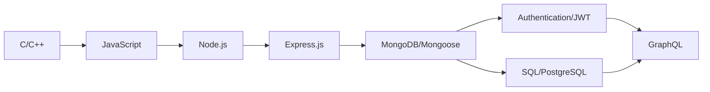

<div align="center">
  
#  Hi there! I'm Adarsh Kumar

[](https://git.io/typing-svg)


</div>

##  About Me 

```javascript
const adarsh = {
  education: "1st Year CSE Student",
  interests: ["Backend Development", "Data Structures & Algorithms"],
  currentFocus: "Node.js",
  code: ["C", "C++", "JavaScript"],
  tools: ["Node.js", "Express", "Git", "REST APIs"],
  challenge: "Building something new every week!"
};
```

##  Tech Stack  

<div align="center">
  
  
  
  
  
  
</div>

## 📌 Highlighted Projects

<div align="center">
  <a href="https://github.com/kumaradarsh2/news-app">
    
  </a>
</div>

### 📰 News Application
> Built an intelligent news aggregator with real-time updates and AI-driven content curation

* Leveraged news APIs to fetch current events
* Integrated AI for personalized article recommendations
* Created responsive UI for seamless experience across devices

## 🌱 Learning Journey



## 🔮 Future Skills Roadmap

- 🏗️ **Backend Architecture** — Building scalable systems
- 🗄️ **Database Optimization** — Performance tuning
- 🔌 **API Design** — RESTful and GraphQL
- 🧩 **Microservices** — Service-oriented architecture

## 📊 GitHub Stats

<div align="center">
  
  
</div>

<div align="center">
  
</div>

<!--
## 🔗 Connect With Me
When you have social links, uncomment this section!

<div align="center">
  <a href="https://linkedin.com/in/yourusername">
    
  </a>
  <a href="https://twitter.com/yourusername">
    
  </a>
  <a href="mailto:your.email@example.com">
    
  </a>
</div>
-->

---

<div align="center">
  
⭐️ From [kumaradarsh2](https://github.com/kumaradarsh2) with 💻 and ☕


</div>
